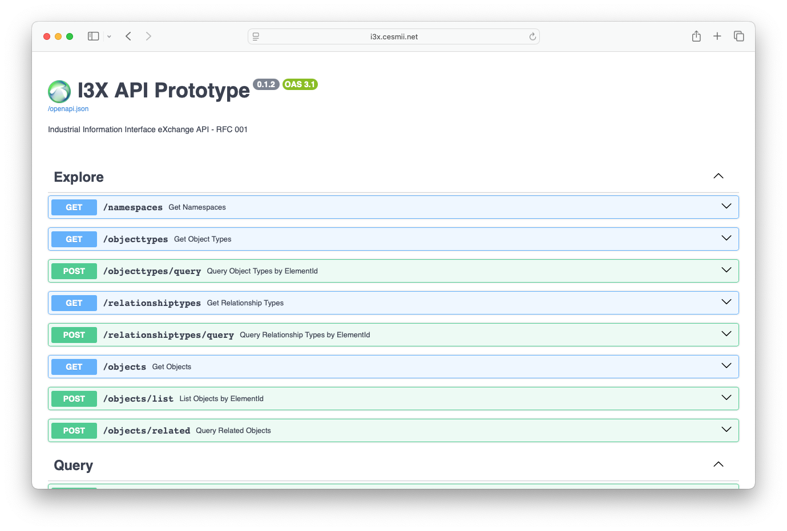
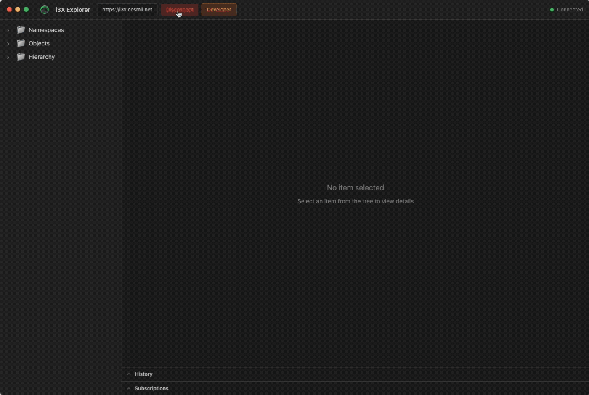
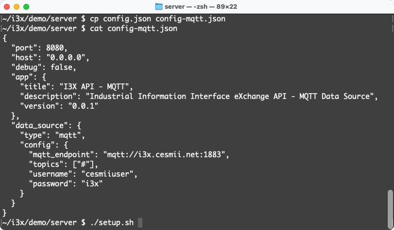

# i3X Quick Start

i3X is the **Industrial Information Interoperability eXchange** API, a vendor-agnostic REST API specification for accessing contextualized manufacturing data. If you're unfamiliar with i3X, please visit [www.i3x.dev](https://www.i3x.dev) for more information.

## The Basics

i3X is an API, it does not provide a data platform or wire protocol. Rather, its functions are bound to (wrapped around) one or more existing platforms, normalizing the interface across heterogeneous architectures. Multiple back-end data sources can be coordinated, provided their data model is unified, to fulfill the interface.

### Key Concepts

| Concept | Description |
|---------|-------------|
| **Namespace** | Logical scope grouping related types and instances (identified by URI) |
| **ObjectType** | Schema definition for a class of objects (machines, sensors, orders) |
| **Object** | An instance with attributes, values, and hierarchical organization |
| **RelationshipType** | Connection definition between objects (HasParent, HasComponent, custom) |
| **ElementId** | Unique string identifier for any element in the address space |
| **VQT** | Value-Quality-Timestamp structure for data values |

```
Namespace (URI)
└── ObjectType (schema)
    └── Object (instance)
        ├── Attributes (metadata: DisplayName, ParentId, NamespaceURI)
        └── Values (VQT: value, quality, timestamp)
            └── Child Objects (composition, controllable via maxDepth)
```

### API Operations

**Explore** — Discover the data model
- `GET /namespaces` — List available namespaces
- `GET /objecttypes` — Get type schemas (filterable by namespace)
- `GET /objects` — List instances (filterable by TypeId)
- `POST /objects/related` — Traverse relationships between objects

**Query** — Read current and historical data
- `POST /objects/value` — Get last known values (with optional depth for composition)
- `POST /objects/history` — Retrieve time-series data within a range

**Update** — Write data back to the platform
- `PUT /objects/{elementId}/value` — Update current value
- `PUT /objects/{elementId}/history` — Modify historical records

**Subscribe** — Real-time data streaming
- `POST /subscriptions` — Create subscription (stream or sync)
- `GET /subscriptions/{id}/stream` — Server-Sent Events for live updates
- `POST /subscriptions/{id}/sync` — Pull queued updates for sync

### Relationships

Understanding relationships is key to understanding i3X. The API requires two kinds of relationships, 
and offers a third, optional kind if supported by the underlying platform.

- **Hierarchical** — An organizational parent/child relationship of objects (eg: Plant > Area > Line)
- **Composition** — How a complex object is constructed of component parts, each part having its own ObjectType (indicated with `isComposition`)
- **Graph** — Any relationship other than the previous two (eg: CanFeed, MonitoredBy)

For further exploration of relationships, please see the [Demo data Read Me](https://github.com/cesmii/i3X/tree/main/demo).

## Step 1: View the API

Explore the API in action with Demo data at the public endpoint: [https://api.i3x.dev/v0/docs](https://api.i3x.dev/v0/docs)

[](https://api.i3x.dev/v0/docs)
For example: 

- Try using the `namespaces` endpoint to discover what Namespaces are present in the server.
- Use the `objects` endpoint to discover what Objects are present.
- Pick an object, by elementId, and use the `related` endpoint to find relationships with other objects.

## Step 2: Visualize the Model

### Download i3X Explorer

i3X Explorer is a free client that works with any compliant i3X implementation, although features may vary depending on back-end implementation.

- Visit [https://acetechnologies.net/i3X/](https://acetechnologies.net/i3X/)
- Click the **Downloads** button
- From the most recent release, choose a deployment package suitable for your platform (Mac, Windows or Linux)

### Launch i3X Explorer

- Open i3X Explorer from your Start Menu, Dock or Launcher
- Connect to the Demo endpoint at https://api.i3x.dev/v0



### Explore the Address Space

- Expand the Namespaces tree in the left panel. Expand a Namespace and note the Types that are present. Expand a Type and note the Instance Objects.
- Expand the Objects tree in the left panel. Note the simple Objects. Expand a complex Object, such as **pump-101** to see its Component Types.
- Expand the Hierarchy in the left panel. Note how the objects are organized.
- Select **TempSensor-101**, note the current value.
- Click the **Subscribe** button at the top right. Click **Start Stream** to see the values updating in real-time.

## Step 3: Create a Server

This step requires Python 3, and will use the sample MQTT adapter included in the Demo. You can use your own MQTT broker, or the sample Broker provided by CESMII.

### Download the Repo

- Clone the i3X repo: `git clone https://github.com/cesmii/i3X.git`

### Configure the Server

- Change directory to the Demo server project: `cd i3x/demo/server`
- Copy the MQTT config file into place as the default config: `cp config-mqtt.json config.json`
- *Optional: edit `config.json` to point to your own MQTT broker if you prefer*

### Start the Server

The startup script creates a virtual environment and installs pre-requisites on most platforms:

- Mac/Linux/WSL: `./setup.sh`
- Windows PowerShell: `./setup.ps1`


### Connect with i3X Explorer

- Disconnect i3X Explorer from the public endpoint
- Connect i3X Explorer to your newly created local endpoint: `http://localhost:8080`
- Explore the Namespaces and Address Space provided by the MQTT Adapter

## Step 4: Create Your Own Client

This setup requires Python 3, and will use the `i3x-client` <a href="https://pypi.org/project/i3x-client/" target="_blank">library available in pip</a>. Modern best practices require using a virtual environment, but we'll bypass that for simplicity.

Examples shown should work on Mac, Linux, WSL and Windows PowerShell. Windows command line users will need to modify paths.

- Create a folder for your new project: `mkdir ~/my-i3x-client`
- Change directory to your new folder: `cd ~/my-i3x-client`
- Install the i3x-client library: `pip install i3x-client --break-system-packages`
- Create a new file to contain your script:
    - Mac/Linux/WSL: `nano main.py`
    - Windows: `notepad main.py`

Copy/Paste this code block into your text editor:

```
import i3x

# Connect to an i3X server
client = i3x.Client("http://i3x.cesmii.net")
client.connect()

# Explore the data model
namespaces = client.get_namespaces()
object_types = client.get_object_types()
objects = client.get_objects(type_id="some-type")

# Read values
value = client.get_value("element-id-1")
print(value.data[0].value, value.data[0].quality)

# Disconnect
client.disconnect()
```

## Learning More

[Server](Server-Developers/00-overview.md) and [Client](Client-Developers/00-overview.md) Developers can find specific documentation in the appropriate sections on this site.

All of the projects used in this Quick Start are open and open source. For example:

- i3X Explorer has a Developer Tools button that allows you to observe all network request and responses between the client and the server. You can view the source of the client itself at [https://github.com/ace-technologies-inc/i3X-Explorer](https://github.com/ace-technologies-inc/i3X-Explorer).
- The i3x-client Python library has more guidance on the [PyPi project page](https://pypi.org/project/i3x-client/), or you can view the source code at [https://github.com/cesmii/python-i3x-client](https://github.com/cesmii/python-i3x-client).
- The Demo server and MQTT adapter are a part of the i3X Working Group project. The source code, documents and project details are at [https://github.com/cesmii/i3x](https://github.com/cesmii/i3x).
